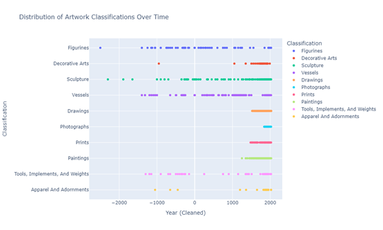
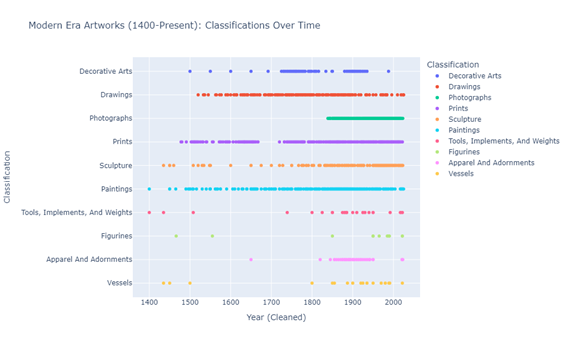
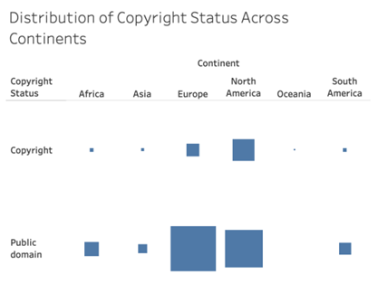
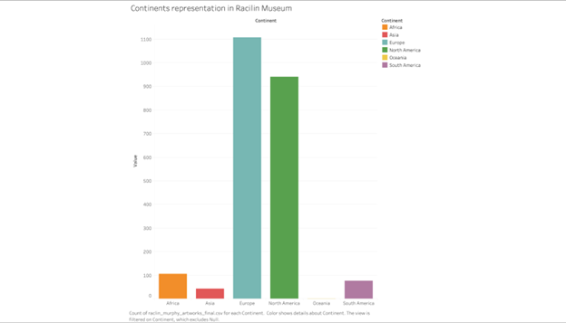

# Analyzing_Notre_Dame-s_Art_Collection
This Project will explore the art collection at the Raclin Murphy Art Museum (the on campus art museum for the University of Notre Dame) 

# Introduction & Motivation
Located on the campus of the University of Notre Dame, the Raclin Murphy Museum of Art houses more than 4,000 works, spanning from antiquity to the present across a wide range of artistic forms. As both a teaching museum and a community resource, the Raclin Murphy Museum of Art supports Notre Dame’s academic mission by making its collections available for research, exhibitions, and educational programming. Beyond gallery displays, the museum digitizes its collections, though not all works are fully cataloged or accessible online, underscoring the need for structured data analysis to reveal patterns and gaps in documentation and acquisition.

As previously mentioned, the Raclin Murphy serves as both an educational and exhibition space, highlighting the importance of identifying gaps in the collections, expanding access to works not yet digitized or made public, and tracking the types of works acquired and displayed. This question of what is recorded, preserved, and made accessible is crucial to shaping the museum’s academic impact and public relevance. Additionally, with omissions in the artwork made available, students and faculty may miss opportunities to engage with works that support their research and teaching. The problem at hand raises concerns surrounding digitization, which can unintentionally create bias as more prominent works receive priority while certain artists and media are disproportionately represented.

# Data Collection Process
Our data collection process began by navigating through the Raclin Murphy Museum of Art webpage, which includes upcoming events and featured exhibits. However, the entirety of the museum’s collection is housed in a separate university resource called MARBLE (Museums, Archives, Rare Books & Libraries Exploration). MARBLE is a research tool developed by the University of Notre Dame that provides a searchable online database of the University’s cultural heritage collections. From a data collection perspective, MARBLE houses over 21,000 records, of which only 4,413 were relevant to Raclin Murphy’s collection. Our team turned to Copilot to assist with scraping the database and structuring the data for analysis.

Inspecting MARBLE’s web source, we provided Copilot with the link structure to navigate into each record, instructing it to collect key components from each piece. We then directed Copilot to move from one record to the next until all artworks were scraped. It took several iterations to enable smooth operation between pages, but eventually the code produced a CSV that contained exactly all 4,413 works.

The final unstructured dataset included: Title, Link (to individual work on the MARBLE website), Artist, Year, Classification, Related_location, Medium, Dimensions, Credit_line, and Copyright_status. The data needed to be cleaned and required extensive wrangling to reach a form that would be usable for future analysis. 

# Data Wrangling Process
The wrangling process started by tackling the date column, as it contained numerous different formats, including but not limited to “1940s,” “mid-20th century,” and “50 BCE – 150 AD.” As you can see, if anyone were looking to perform analysis concerning dates, it wouldn’t be feasible in its current state. Therefore, we created a new date feature, “year,” that could support a continuous date type. The idea was simple in theory: anytime there was a large date range, take the midpoint, and if dates were tagged BCE, convert them to negative values. Finally, it’s important to mention that for the cleaned_year column, we extracted only the year, leaving behind the month and day, as exact dates were rarely available. Thus, the final cleaned_year column provided a continuous date scale that could be used to plot artworks on a time scale. Although this field should only be used for broad analysis, as taking the average of date ranges does add bias. 
We also noticed the original date column had two forms of null values. In one instance, the data truly had a null value, but other times, when the date wasn’t present, it would include the string “(no date).” For future analysis, we figured it would be beneficial to have the ability to count all null values. Thus, we converted all “(no date)” string fields to true null values.
Afterwards, we noticed a small handful of data points failed to scrape a copyright_status. However, when using the links provided, it was made clear that the data did, in fact, have a copyright_status present. Instead of rerunning the entire program and asking the AI to resolve any problems, we extracted records that had a blank copyright_status and reran those through an updated scraper that focused solely on extracting copyright_status. This worked, and we overlaid the new copyright_status records on the original dataset. Now, with all records providing a copyright_status, we can determine the proportion of records available in the public domain.

Next, we noticed certain artists had special characters in their names, such as the copyright symbol. While the data was consistent in its use of out-of-place non-Greek letters and numbers, we wanted to strip these away for readability. Using a regex function and the Unicode of various symbols, we removed all special characters from artist names. Unfortunately, this removed accented characters as well – even though we only provided specific unicodes – but we decided to keep the data without any characters that were not in the A-Z or numeric.
Next, we worked on the related_locations column. This column presented a unique problem, as there were many rows that did not have any information listed in them. We simply could not remove the rows with no data relating to locations, but we wanted to have a cleaner representation of columns. So we decided to break down the column into four different rows: Continents, Countries, States/Provinces, and Cities/Towns. To do this, we used ChatGPT in order to provide a large amount of context for the problem. In this process, ChatGPT suggested the use of a library called “geopy" within Python. This library would work with available API’s to provide the location names individually. After running the code, we noticed that the new columns we generated weren’t being filled with any data. 

The geopy library was not effective as it required inputs such as the address, latitude, and longitude. After learning about this, we decided to use a hybrid code of AI-generated Code with and without the library. This newly generated code was able to fill out the continents and countries columns, but not the states/provinces and city/town columns. This goes back to the problem of not having the exact location data available. While we considered trying to fill in these columns, we ultimately decided not to do so. We noticed that there was already a large amount of rows with no location data, and when we began specifying by continent, the data related to it shrank, and became even smaller when evaluating rows with countries. At the rate it is decreasing, it would not be sensible to obtain the additional location data. Since location wasn’t a primary point of evaluation, we decided to leave the location analysis at the country level. We also refrained from dropping rows that did not have any location information, as this would result in losing around half the dataset, which could be used for analysis of other qualities. 

Finally, once all fields were clean and manually examined for errors, we dropped any records that had missing values for all of the following: Classification, Artist, and Title. We deemed these records too sparse for data analysis. 

# Conclusions/Deliverables
Through a comprehensive cleaning process, we transformed a raw dataset of 4,413 artworks from the Raclin Murphy Museum into a clean, structured format suitable for robust analysis. Throughout the wrangling process, we standardized inconsistent date formats into a single “cleaned_year” field, converted placeholder strings like “(no date)” into true null values, filled missing copyright statuses through targeted re-scraping, removed special characters from artist names to ensure consistency, and broke down location information into continent and country fields. In addition, we removed records lacking essential identifying details such as classification, artist, and title in order to preserve the overall quality and integrity of the dataset. Each of these steps contributed to producing a dataset that is both internally consistent and analytically usable.

The final deliverable is a comprehensive CSV file that reflects the museum’s collection in a standardized format. This dataset can now support a wide range of analytical approaches, from examining acquisition trends over time to evaluating geographic representation. By resolving structural inconsistencies and filling key gaps, we established a solid foundation that positions the dataset for immediate use in deeper analytical and modeling work.

# Reflection on Copilot Use
When implementing Copilot, we encountered both strengths and limitations. At the beginning of the project, we utilized Copilot to create a scraper that collected data from the MARBLE website. The first attempt was successful but only returned surface-level information, such as title, artist, and date (when available). To capture more detailed data, we needed the AI to navigate into each object’s link and extract additional information. This required manually inspecting the page source and providing precise instructions, including the exact wording and element paths, allowing the scraper to locate and record the data correctly. Although the code took a long time to run, leveraging AI to automate the coding process ultimately saved us a great deal of time and effort.

When it came to cleaning the data, we started with dates, as there were over 20 unique formats. Without much instruction, the AI was decent at intuitively converting date types into a singular year; However, for many date formats, we needed to manually tell the AI what to look for and how we expected to handle it. Additionally, Copilot was successful when asked to remove instances when “(no date)” appeared in the date column and left those cells blank. Next, we cleaned the “artist” column to remove special characters, specifically the copyright sign and other unique symbols. We worked with Copilot to remove the special characters; however, it was apparent that Copilot was having issues, even when we provided unicodes to remove specific symbols. After attempting to clean this column with Copilot, we moved to using ChatGPT to produce the correct code, placing it back into VS Code to run and ultimately generate the correct output. It should be noted that this process removed all characters that were not A–Z or numeric, thereby deleting accented letters and tildes, which represents a limitation in the dataset.

Since ChatGPT was successful in providing correct code to run, we would continue to use it for creating new columns based on locations. However, using ChatGPT requires more time to produce precise results. ChatGPT does not run inside the code editing software itself, except when working through Copilot. Due to this, we needed to provide ChatGPT with more context for our project and the problems we were trying to solve. Once we set up the context and provided the appropriate prompts, our use of ChatGPT proved to be highly effective and efficient. Although it was not able to generate code to filter state/provinces and cities/towns, GPT was effective in generating new columns for the location data. Its inability to generate the complete information was more of a shortcoming of geopy due to the data not being formatted to work with geopy and the API interfaces it utilizes. 

# Appendix

# Figure 1 – Presenting proof of concept: tracking art classification on a continuous time scale. 

# Figure 2 – Presenting proof of concept: Classification by time in the modern era

# Fig. 3 (Top) – Proof of concept distribution of art by copyright status and continent. 

# Fig. 4 (Bottom) – Proof of concept distribution by continent 

Works Cited
“Raclin Murphy Museum of Art.” Raclin Murphy Museum of Art, raclinmurphymuseum.nd.edu/. 
Accessed 3 Oct. 2025. 
University of Notre Dame, Hesuburgh Libraries. “Museums, Archives, Rare Books & Libraries 
Exploration.” MARBLE, marble.nd.edu/. Accessed 3 Oct. 2025. 

